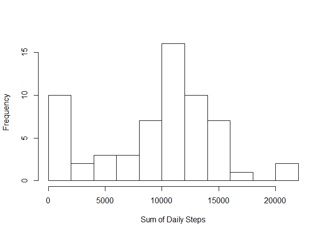
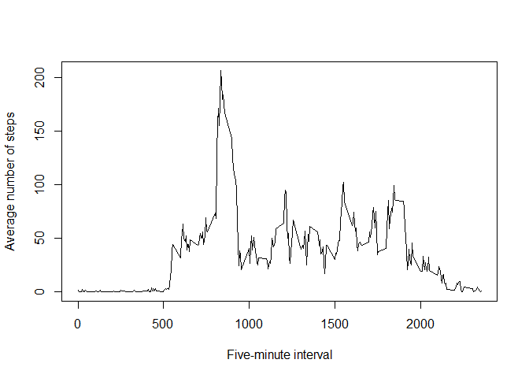
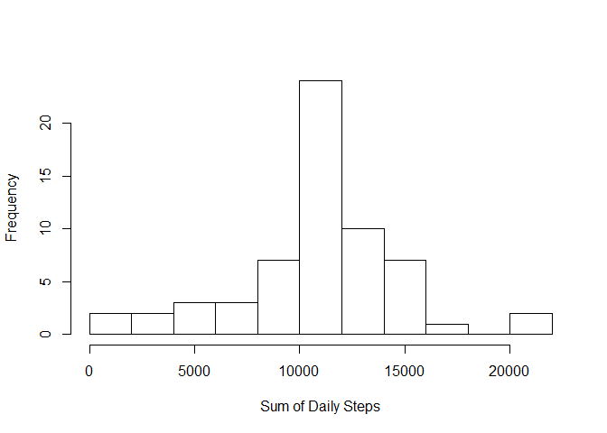

#### Initiating the analysis
. Set the working directory 

```r
setwd("C:/Coursera/Course_5/Assignment_1")
```

. Open the data.table library

```r
library(data.table)
```

```
## Warning: package 'data.table' was built under R version 3.5.1
```

. Download the data file from the source in case it has not been downloaded before

```r
if(!file.exists("activity.csv")){
    fileURL <- "https://d396qusza40orc.cloudfront.net/repdata%2Fdata%2Factivity.zip"
    download.file(fileURL, destfile = "activity.zip", method = "curl")
    unzip("activity.zip")
}
```


#### Loading and preprocessing the data

1. Load the data

```r
stepsdata <- read.table("activity.csv", header = TRUE, sep = ",", stringsAsFactors = FALSE)
```
The following shows a couple of rows of the data set 

```r
head(stepsdata)
```

```
##   steps       date interval
## 1    NA 2012-10-01        0
## 2    NA 2012-10-01        5
## 3    NA 2012-10-01       10
## 4    NA 2012-10-01       15
## 5    NA 2012-10-01       20
## 6    NA 2012-10-01       25
```

2. Process/transform the data (if necessary) into a format suitable for your analysis.

Here, the date column is reformated as date class for future use.

```r
stepsdata$date <- as.Date(stepsdata$date, "%Y-%m-%d")
```


#### What is mean total number of steps taken per day?

1. Calculate the total number of steps taken per day.

The following code calculates the total daily steps ingnoring the missing values.

```r
dailysum <- with(stepsdata, tapply(steps, date, sum, na.rm = TRUE))
```

2. Make a histogram of the total number of steps taken each day.

```r
hist(dailysum, breaks = 15, xlab = "Sum of Daily Steps", main = "")
```

<!-- -->

Save the figure

```r
dev.copy(png, file = "Plot1.png") 
dev.off()
```


3. Calculate and report the mean and median of the total number of steps taken per day.

```r
totalmean <- mean(dailysum)
totalmedian <- median(dailysum)
```
The mean and median of the total number of steps are equal to 9354.2295082 and 10395, respectively. 


#### What is the average daily activity pattern?

1. Make a time series plot of the 5-minute interval (x-axis) and the average number of steps taken, averaged across all days (y-axis).

```r
meanbyinterval <- with(stepsdata, aggregate(steps ~ interval, FUN = "mean"))
plot(meanbyinterval$interval, meanbyinterval$steps, type = "n", xlab = "Five-minute interval", ylab = "Average number of steps")
lines(meanbyinterval$interval, meanbyinterval$steps)
```

<!-- -->

Save the figure

```r
dev.copy(png, file = "Plot2.png") 
dev.off()
```

2. Which 5-minute interval, on average across all the days in the dataset, contains the maximum number of steps?

```r
maxinterval <- meanbyinterval$interval[which.max(meanbyinterval$steps)]
```
The maximum number of steps belong to 835 interval. 


#### Imputing missing values
Note that there are a number of days/intervals where there are missing values. The presence of missing days may introduce bias into some calculations or summaries of the data.

1. Calculate and report the total number of missing values in the dataset.

```r
Narows <- !complete.cases(stepsdata)
nNa <- sum(Narows)
```
The total number of missing values is 'r nNa'.

2. Devise a strategy for filling in all of the missing values in the dataset. 

The missing values with be replaced with the mean of their associated 5-minute interval. The methodology and codes are presented in reponse to the next question. 

3. Create a new dataset that is equal to the original dataset but with the missing data filled in.

```r
rownames(meanbyinterval) <- as.character(meanbyinterval$interval)
meanbyinterval$interval <- NULL
stepsdata_compl <- stepsdata
stepsdata_compl$steps[Narows] <- meanbyinterval[as.character(stepsdata$interval[Narows]),1]
```
The following shows a couple of rows of the data set 

```r
head(stepsdata_compl)
```

```
##       steps       date interval
## 1 1.7169811 2012-10-01        0
## 2 0.3396226 2012-10-01        5
## 3 0.1320755 2012-10-01       10
## 4 0.1509434 2012-10-01       15
## 5 0.0754717 2012-10-01       20
## 6 2.0943396 2012-10-01       25
```

4. Make a histogram of the total number of steps taken each day and Calculate and report the mean and median total number of steps taken per day. Do these values differ from the estimates from the first part of the assignment? What is the impact of imputing missing data on the estimates of the total daily number of steps?

```r
dailysum_compl <- with(stepsdata_compl, tapply(steps, date, sum, na.rm = TRUE))
hist(dailysum_compl, breaks = 15, xlab = "Sum of Daily Steps", main = "")
```

<!-- -->

Save the figure

```r
dev.copy(png, file = "Plot3.png") 
dev.off()
```

By comparing the two histograms, it can be observed that filling the missing data has significant effect of the shape of the histogram. The new mean and median of the total number of steps are calculated as follows:

```r
totalmean_compl <- mean(dailysum_compl)
totalmedian_compl <- median(dailysum_compl)
```
The results show than the mean of the new data set is increased (from 9354.2295082 to 10766.19). 
Also, the meadian of the new data set is increased (from 10395 to 10766.19). 


#### Are there differences in activity patterns between weekdays and weekends?

1. Create a new factor variable in the dataset with two levels - "weekday" and "weekend" indicating whether a given date is a weekday or weekend day.

```r
wd_levels <- c("Monday", "Tuesday", "Wednesday", "Thursday", "Friday", "Saturday", "Sunday")
wd_labels <- c("Weekday", "Weekday", "Weekday", "Weekday", "Weekday", "Weekend", "Weekend")
stepsdata_compl$WeekDay <- factor(weekdays(stepsdata_compl$date, abbreviate = FALSE), levels = wd_levels, labels = wd_labels)
```

2. Make a panel plot containing a time series plot of the 5-minute interval (x-axis) and the average number of steps taken, averaged across all weekday days or weekend days (y-axis). 

```r
meanbyintervalbyweekday <- with(stepsdata_compl, aggregate(steps ~ interval + WeekDay, FUN = "mean"))
library(ggplot2)
```

```
## Warning: package 'ggplot2' was built under R version 3.5.1
```

```r
qplot(interval, steps, data = meanbyintervalbyweekday, facets = WeekDay ~ ., geom = "line")
```

<!-- -->

Save the figure

```r
ggsave("Plot4.png")
```

```
## Saving 7 x 5 in image
```
